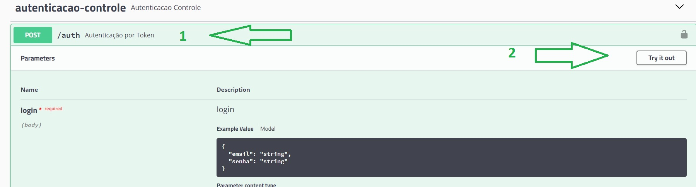

# BlueBank


Este projeto visa a construção de uma aplicação bancaria digital, que permite aos usuários do Blue Bank realizarem operações de saques, depositos, e transferências, como também acesso ao extrado bancario. 
Todas estas requisições são realizadas diretamente ao backend construido em Java utilizando Spring Framework.

Projeto de apresentação final do PAN Academy, um programa de treinamento do Banco PAN em parceria com a Gama Academy. Aulas ministradas por Marianne Salomão (https://github.com/mariannesalomao).

## Pré Requisitos
* [**Git**](https://git-scm.com/)
* [**Java 11+**](https://jdk.java.net/15/)
* [**Mysql 8+**](https://dev.mysql.com/downloads/)

<h3>Requisitos e funcionalidades</h3>

- <h4> Obrigatórios da entrega:</h4>

    - Planejamento (Metodologias Ágeis):
        - [X] Kanban com todas as tarefas organizadas e responsáveis definidos.
    - Projeto (Backend):
        - [X] Cadastro de clientes.
        - [X] Listagem de clientes.
        - [X] Atualização de clientes.
        - [X] Deletar clientes.
        - [X] Histórico de transações entre contas.
    - Banco de Dados:
        - [X] Tabelas bem estruturadas e populadas com valores para testes.
        - [X] O banco deve ser entregue em script SQL junto ao repositório.
    - Gerais:
        - [X] O código deve ser entregue em um repositório no Github.
        - [X] A API deve ser disponibilizada em ambiente AWS com EC2 e em Beanstalk.
        - [X] A aplicação deve ter um pipeline em Jenkins ou no <b>Aws Build</b>.
        - [X] A aplicação precisa ser configurada no API Gateway da AWS.
        - [X] A aplicação precisa ter no mínimo um endpoint de SNS para cadastro de emails e verificação automática.
        - [X] A aplicação precisa ter no mínimo um Lambda.
        - [X] Liste os endpoints no README.md
        - [X] O Banco deve ser entregue em script SQL junto ao repositório.


## Listagem de Endpoints por Classes:

<H3>autenticacao-controle</H3>

| MÉTODO | ENDPOINT | DESCRIÇÃO |
| --- | --- | --- |
| <a></a> | /auth | Autenticação por Token |

<H3>cliente-controle</H3>

| MÉTODO | ENDPOINT | DESCRIÇÃO |
| --- | --- | --- |
| <a></a> | /clientes | Lista todos os clientes |
| <a></a> | /clientes | Cadastra um cliente, com atribuição dinâmica de ID |
| <a></a> | /clientes | Atualiza um cliente |
| <a></a> | /clientes/{id} | Lista um cliente, filtrando pelo ID |
| <a></a> | /clientes/{id} | Atualização de telefone, email e senha do cliente, filtrando pelo ID |
| <a></a> | /clientes/{id} | Deleta um cliente, filtrando pelo ID |
| <a></a> | /clientes/credenciais/{id} | Atualiza as credenciais do cliente, filtrando pelo ID |

<H3>conta-controle</H3>

| MÉTODO | ENDPOINT | DESCRIÇÃO |
| --- | --- | --- |
| <a></a> | /contas | Lista todas as contas |
| <a></a> | /contas/{id} | Lista uma conta, filtrando pelo ID |

<H3>funcionario-controle</H3>

| MÉTODO | ENDPOINT | DESCRIÇÃO |
| --- | --- | --- |
| <a></a> | /funcionarios | Lista todos os funcionários |
| <a></a> | /funcionarios | Cadastra um funcionário |
| <a></a> | /funcionarios | Atualiza os dados de um funcionário |
| <a></a> | /funcionarios/{id} | Lista um funcionário, filtrando pelo ID |
| <a></a> | /funcionarios{id} | Atualiza os dados de um funcionário, filtrando pelo ID |
| <a></a> | /funcionarios/{id} | Deleta o cadastro de um funcionário |
| <a></a> | /funcionarios/cadastrarEmail/{email} | Confirma o cadastro de um funcionário, com aviso por e-mail |
| <a></a> | /funcionarios/credenciais/{id} | Atualiza as credenciais de um funcionário |

<H3>perfil-controle</H3>
    
| MÉTODO | ENDPOINT | DESCRIÇÃO |
| --- | --- | --- |
| <a></a> | /perfis | Cadastro de perfil |
| <a></a> | /perfis | Exclusão de perfil |
    
<H3>transacao-controle</H3>

| MÉTODO | ENDPOINT | DESCRIÇÃO |
| --- | --- | --- |
| <a></a> | /transacoes | Lista todas as transacoes efetuadas |
| <a></a> | /transacoes/depositar | Efetua um depósito na conta do cliente |
| <a></a> | /transacoes/depositar/{contaId} | Efetua um depósito na conta do cliente, filtrado pelo ID |
| <a></a> | /transacoes/sacar | Efetua um saque da conta do cliente |
| <a></a> | /transacoes/sacar/{contaId} | Efetua um saque da conta do cliente, filtrado pelo ID |
| <a></a> | /transacoes/transferir/{contaIdDestino} | Efetua uma transferência para outro cliente do banco |
| <a></a> | /transacoes/transferir/{contaIdOrigem}/{contaIdDestino} | Transferência entre contas do banco, filtrada pelos ID´s ||

## SWAGGER

* [**acesso ao swagger**](http://pancoders.us-east-2.elasticbeanstalk.com/swagger-ui.html#/) 

* Para efetuar os testes no swagger, o usuário precisa logar no sistema com o perfil de "cliente" ou "funcionário":
1. Em "autenticacao-controle", clicar no endpoint **/auth**;
2. Na tela que abrir, clicar em "**Try it out**";



3. Substituir os campos "string" pelo e-mail e senha do usuário;

- Para "cliente", utilizar "**cliente1@gmail.com**" no campo email e "**cliente123**" no campo senha;
- Para "funcionário" utilizar "**funcionario1@gmail.com**" no campo email e "**funcionario123**" no campo senha;
- Obs: Clientes terão acesso às operações básicas em sua própria conta, como saque, depósito etc. Funcionários terão acesso irrestrito;

4. Clicar em "Execute";


<h3>Extras:</h3>
- Link do projeto utilizado no AWS Lambda: https://github.com/jmvgcomp/pan-academy/tree/master/modulo-java/s2t2lambdaaws
- Jira: 


**Para contribuir:**

```bash
git clone https://github.com/nicolay-padalko/BlueBank.git
```

## Equipe PanCoders
<a href="https://github.com/oChrys" target="_blank" rel="noopener noreferrer"></a> <a href="https://www.linkedin.com/in/chrystianmoliveira/" target="_blank" rel="noopener noreferrer"></a>  Chrystian Medeiros 

<a href="https://github.com/GiselleForjaz" target="_blank" rel="noopener noreferrer"></a> <a href="https://www.linkedin.com/in/giselle-forjaz-a8166b59/" target="_blank" rel="noopener noreferrer"></a>  Giselle Forjaz

<a href="https://github.com/jessicacorreaes" target="_blank" rel="noopener noreferrer"></a> <a href="https://www.linkedin.com/in/jessicacorreaes/" target="_blank" rel="noopener noreferrer"></a>  Jéssica Corrêa 

<a href="https://github.com/jessikasousa" target="_blank" rel="noopener noreferrer"></a> <a href="https://www.linkedin.com/in/jessikasousa" target="_blank" rel="noopener noreferrer"></a>  Jéssika Sousa 

<a href="https://github.com/jmvgcomp" target="_blank" rel="noopener noreferrer"></a> <a href="https://www.linkedin.com/in/joananthamatheus/" target="_blank" rel="noopener noreferrer"></a>  Joanantha Matheus Vieira

<a href="https://github.com/nicolay-padalko" target="_blank" rel="noopener noreferrer"></a> <a href="https://www.linkedin.com/in/nicolay-padalko-a9a90923/" target="_blank" rel="noopener noreferrer"></a>  Nicolay Padalko

<a href="https://github.com/rsbastos" target="_blank" rel="noopener noreferrer"></a> <a href="https://www.linkedin.com/in/ren%C3%A9-dos-santos-bastos-9125661b0/" target="_blank" rel="noopener noreferrer"></a>  René Bastos

